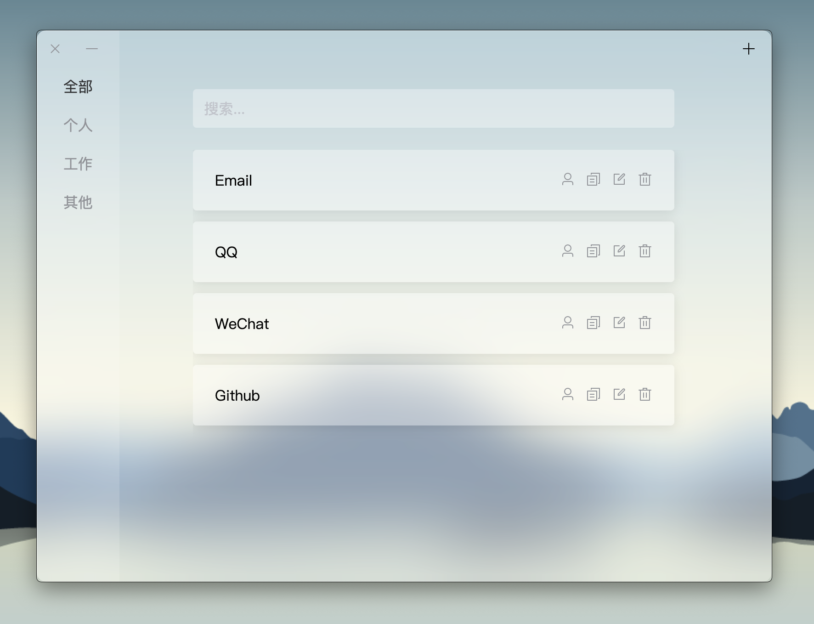
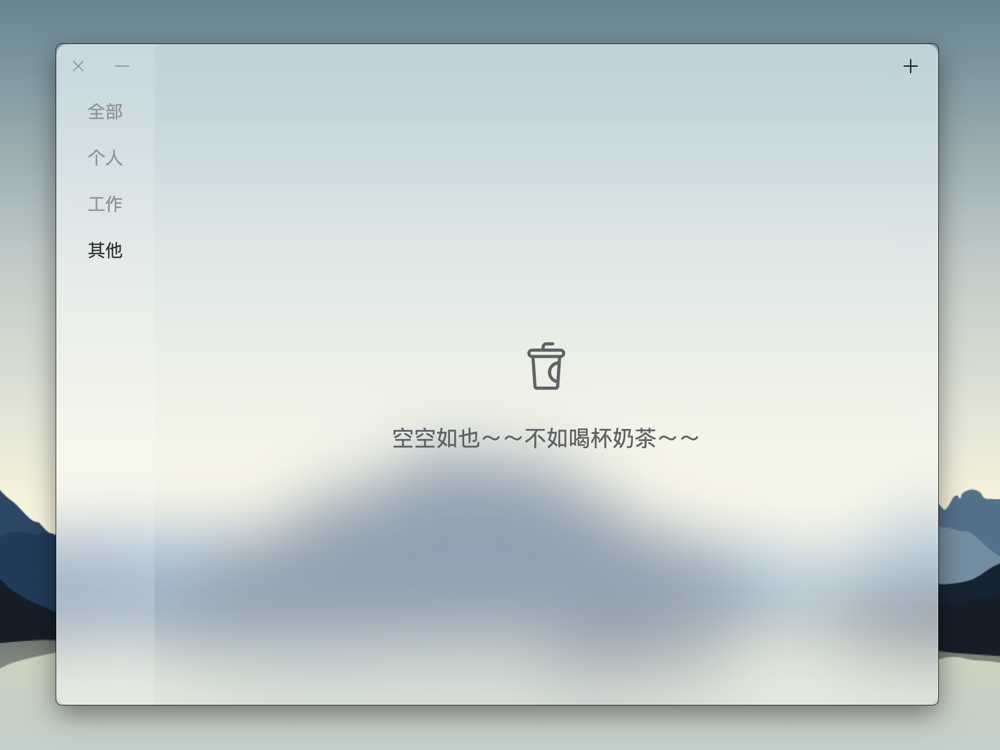
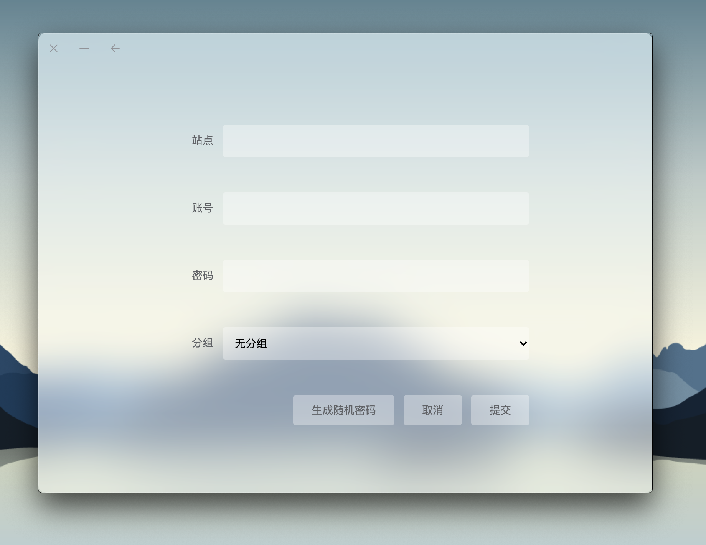

# 青稞

## 简介

青稞是一个只在本地存储的密码管理器。目前主流密码管理器都是设备同步、云端存储，对其不太放心，因此开发此密码管理器，没有设备同步，也没有云端存储的本地密码管理器。

工作场景密码繁多，一直想去处理，没有合适的解决方案，最终还是自己开发个小工具来处理吧！

> 后来突然来劲，去学了下swift，用swift开发了一遍，叫做[rePass](https://apps.apple.com/cn/app/repass/id1570028651)，且上线App Store了，搞了个icloud同步 + 跨平台，加入了苹果设备的生物识别功能，有兴趣的小伙伴可以试试。😄

## 下载

[Mac](https://github.com/Kuari/QingKe/releases/download/v1.0.0/qingke-1.0.0.dmg)

## 截图

## 功能

* 密码分组、搜索
* 站点、账户、密码存储
* 密码快捷复制
* 本地存储加密

## ToDo

- [ ] 程序登录密码
- [ ] Windows平台兼容

## License

Apache License. Copyright (c) 2021 kuari.